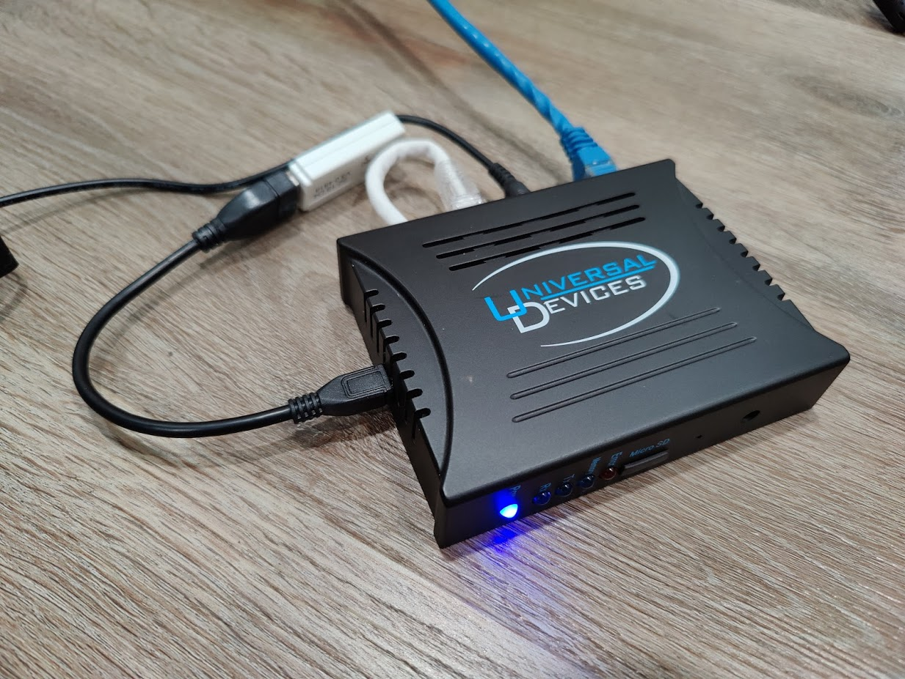
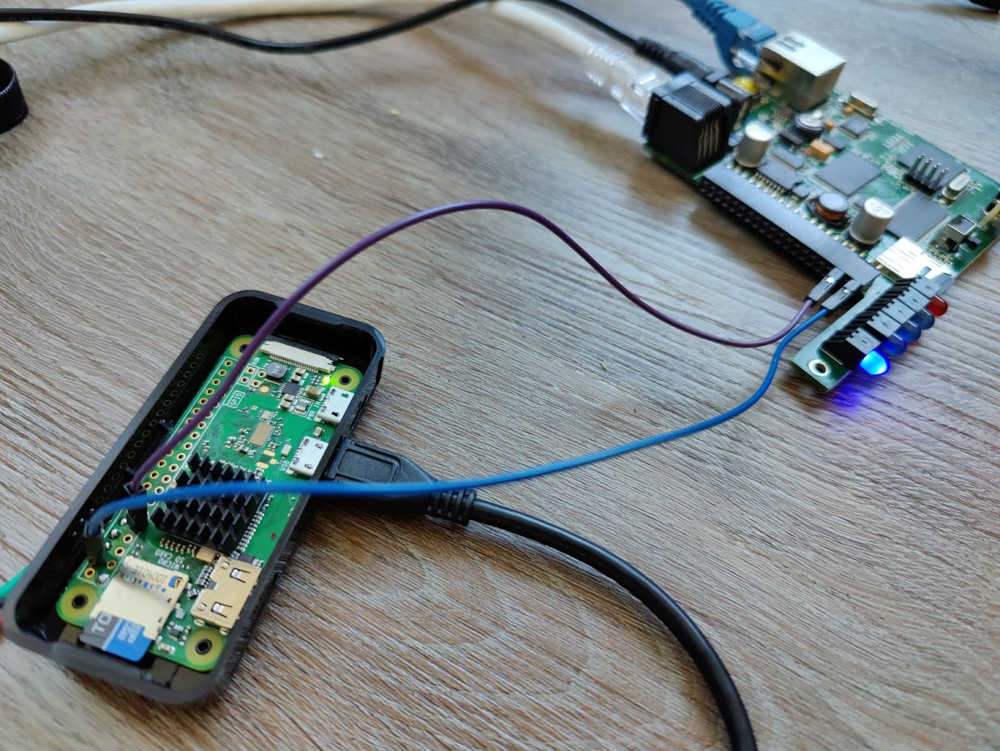

# Bridging ISY994i to Insteon USB PLM

This file describes all the steps you need to do in order to use this tool to bridge the communication between an Universal Devices ISY994i and a USB based Insteon PLM such as the 2448A7 or 2413U.

Why would you do this? Because the 2413S (serial port version) is hard to get. I did this also because the 2448A7 isn't connected to the power line and rely on the RF capabilities of an Insteon network. This "should" mean a more reliable PLM since the power line connection is typically the thing which breaks the 2413 devices.

# Potential endresult

If you do all the steps from this guide (soldering and powering from the ISY994), you to can end up with this hybrid 😄

# Disclaimer

Any modifications or use of these instructions and software is done at your own risk. The author takes no responsibility should anything bad happen.

# Requirements

## Non-solder edition

- Raspberry Pi Zero (Wireless)
- Power supply
- MicroSD card
- RS232 to USB converter (link to be added)
- RJ45 breakout connector (link to be added)
- CAT6 patch cable
- USB Hub for Raspberry Pi Zero (since we need 2 USB connections)
- Jumper wires

## Solder edition

- Raspberry Pi Zero (Wireless)
- MicroSD card
- RS232 to TTL converter (link to be added)
- RJ45 crimping tools + connectors
- CAT6 cable (you can of course also sacrifice a CAT6 patch cable instead and avoid crimping)
- OTG USB adapter (to allow connection of a USB Type A connector)
- Jumper wires (if you want to power the Pi from the ISY994)

# Wiring it up (non-solder edition)

1. COnnect patch cable from Port A of the ISY994 to the RJ45 breakout box
2. Looking at the breakout box with the screws facing you, the left most connection is 1 while the right most is 8.
3. Connect a wire from 1 to TXD on the RS232 converter board
4. Connect a wire from 8 to RXD on the RS232 converter board
5. Connect a wire from 7 to GND on the RS232 converter board
6. Connect the RS232 converter to the USB hub
7. Connect the Insteon PLM to another port on the USB hub
8. Connect the USB hub to the center most USB port on the Pi

Done

# Wiring it up (solder edition)

1. Either crimp a RJ45 connector to a piece of CAT6 cable OR cut off one end of an existing CAT6 patch cable. If you're crimping, stick to the T586B layout so that the rest of these instructions line up
2. Make sure you can access striped orange (pin 1),  brown (pin 8) and striped brown (pin 7) on the end of the CAT6 cable (also a good time to confim that this is correctly wired by using a multimeter and continuity mode, see - Jumper wires
)
3. Solder pin 1 to TXD on the RS232 side of the converter
4. Solder pin 8 to RXD on the RS232 side of the converter
5. Solder pin 7 to GND on the RS232 side of the converter
6. Looking at the RPi board, make sure the side of the board with the chips face up with the HDMI/USB connectors pointed towards you. The layout of the GPIO strip starts with 1 at the bottom left (square pad) followed by 2 directly above it, 3 is next to 1, 4 next to 2, and so on.
7. Solder RPi pin 1 to the Vcc pad on the TTL side of the converter
8. Solder RPi pin 6 to the GND pad on the TTL side of the converter
9. Solder RPi pin 8 to the RXD pad on the TTL side of the converter
10. Solder RPi pin 10 to the TXD pad on the TTL side of the converter
11. Connect the USB OTG adapter to the middle USB port of the Pi and then your USB PLM to the Type A port of the adapter

At this point, you're done, however if you want to power the RPi from the ISY994, please follow the next steps as well

1. Open the ISY994 box
2. Remove any existing board from the expansion slot (located directly behind the LED section)
3. Looking at the board, you should have the LED section in the bottom right and the expansion slot should be pointed towards you. All the ports on the board should face the left side.
4. Cut off the pin on two jump wires.
5. Solder one wire to pin 4 on the RPi. This is the 5V rail
6. Solder one wire to pin 9 on the RPi. This is another GND (less messy when you don't need to share with the serial port IMHO)
7. Connect the 5V wire to the top right pin on the expansion slot
8. Connect the GND wire to the third from the right top pin on the expansion slot.

To help show this setup, here's my prototype as it were before I made it permanent

At this point, when the ISY is powered on, it will provide 5V to the RPi and power it as well. 

*PLEASE NOTE! I WOULDN'T PULL A MASSIVE AMOUNT OF POWER FROM THIS SETUP*

It has been tested with a Raspberry Pi Zero Wireless with a USB Insteon stick (not the wallwart, the completely wireless USB stick) and WiFi enabled without any issues, but again, your mileage may vary and I take no responsibilities if somethings breaks or burns up.

Since the RPi takes a while to boot by default, you may want to look at [optimizing the boot](OPTIMIZE_BOOT.md) of your Raspberry Pi.
